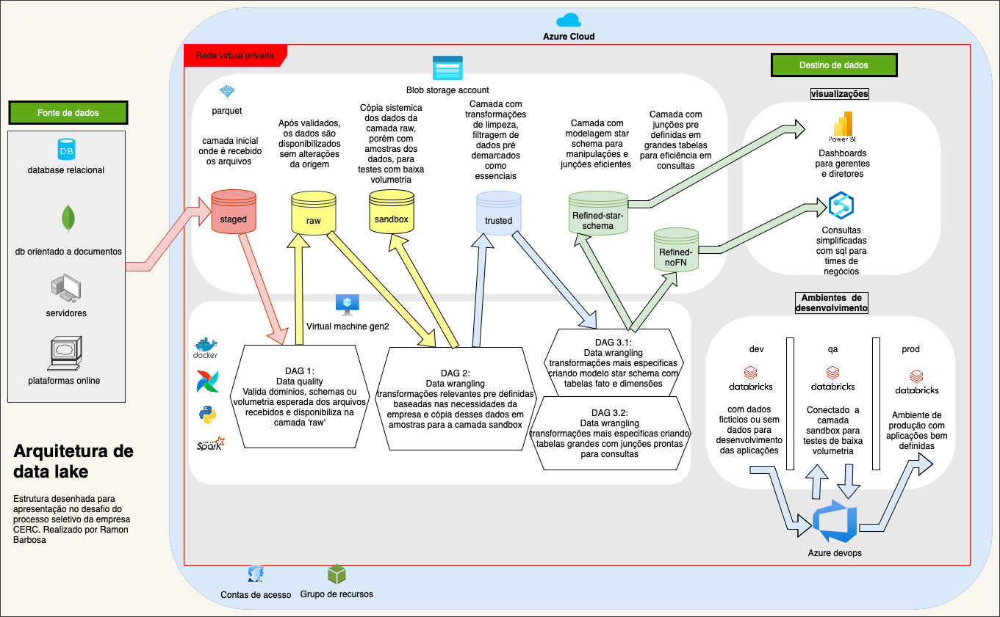

```
                        _      __           ________________  ______
    ____  _________    (_)__  / /_____     / ____/ ____/ __ \/ ____/
   / __ \/ ___/ __ \  / / _ \/ __/ __ \   / /   / __/ / /_/ / /     
  / /_/ / /  / /_/ / / /  __/ /_/ /_/ /  / /___/ /___/ _, _/ /___   
 / .___/_/   \____/_/ /\___/\__/\____/   \____/_____/_/ |_|\____/   
/_/              /___/                                              

```

`TL;DR`

Projeto realizado como desafio e apresentação no processo seletivo da CERC com as frentes principais de Python e criação de arquitetura de data lake.

### `Configurações do repositório`

  - Realizei a cópia do repositório local
  ```
  git clone git@github.com:ramondata/projeto_cerc.git

  git config --global user.name 'Ramon Barbosa'

  git config --global user.mail ramonbarbosafreitas@gmail.com

  git push --set-upstream origin master

  git tag -a tarefa1 -m "tarefa 1 completa"
  ```

  - Foram realizados outros comandos durante a elaboração do projeto, porém esses foram os iniciais.

### `Etapa 1 - Python:`

- [x] `Criação de um módulo com o sistema de log:`
    - Toda a execução do software é registrada num arquivo de log.
    - O diretório de registro se chama log e contém os logs diários
    - Na pasta log existe um subpasta graficos, que salva os gráficos caso seja necessário rever assícronicamente


      i.e.: Sem anecessidade de executar o código novamente pra analisar o gráfico gerado
    - O sistema de log foi configurado num módulo a parte na pasta modulos para manter a organização do código principal

- [x] `Descompactação do arquivo fonte dos dados:`
    - O arquivo original foi compactado para que fosse permitido armazená-lo no github
    - O arquivo fonte é descompactado no começo do runtime e deletado junto com os metadados gerados no final do runtime
    - Pós execução do código, permanece apenas o arquivo compactado
     
- [x] `Leitura do arquivo descompactado:`
    - Realizada a leitura do arquivo com a biblioteca csv do Python
    - O conjunto de linhas do arquivo é salvo numa estrutura de lista de listas do Python
    - Estrutura de list do Python é um recurso iteravél, o que nos permite usá-la em processos com iteradores
     
- [x] `Verificado a quantia de linhas do arquivo:`
    - Para ver o numero de linhas, favor olhar o arquivo de log gerado na pasta log do projeto

- [x] `Verificado a primeira linha:`
    - A primeira linha do arquivo é o `header`, o famoso cabeçalho com o nome das fields do conjunto de dados

- [x] `Verificado a segunda linha:`
    - A segunda linha nos retorna uma amostra dos dados que estão no corpo do arquivo

### `Tarefa 1: Imprima as primeiras 20 linhas usando um loop para identificar os dados.`

- [x] Através de um `foreach`(i.e.: sistema de loop que automaticamente itera a partir do número de itens disponíveis na estrutura de dados lida), Realizei a captura das 20 primeiras linhas do conjunto de dados utilizando o `slice`(fatiamento) da estrutura list do Python

- [x] Logo após é retirado do conjunto de listas o cabeçalho, i.e.: a primeira linha de todas.

### `Tarefa 2: Imprima o genero das primeiras 20 linhas`

- [x] A função map do Python obtém uma função(Esta função pode ser nominal ou lambda), e itera sob um iteravél. Porém realiza essa operação de forma assincrona, deixando as transformações previamente mapeadas pra que seja realizada no momento de acessar esses dados. Logo é mais eficiente que o loop sincrono. Essa função(map) esta no grupo das funções chamadas de `lazy function` que atuam como a explicação anterior.

### `Tarefa 3: Crie uma função para adicionar as colunas(features) de uma lista em outra lista, na mesma ordem`

- [x] Utilizei a função map, aplicando uma função lambda para obter o index informado de cada lista de listas


### `Tarefa 4: Conte cada gênero. Você não deveria usar uma função para isso`

- [x] Utilizei a função map com uma função lambda e uma condição para identificar os casos em que o campo estiver vazio e chamar o iteravel com a string `vazio`
      
- [x] Em seguida realizei com um loop foreach a filtragem de cada elemento e fazendo a contagem na sua variavel de referencia.

- [x] Caso fosse permitido usar uma função printa nesta tarefa, eu usaria a `.count('dado')` para isso. 

- [x] Na função lambda foi aplicado uma função de string chamada `.lower()` para unificar o reconhecimento de todos os itens.

### `Tarefa 5: Crie uma função para contar os gêneros. Retorne uma lista.`

- [x] Criada a função count_gender para realizar a contagem dos itens de gênero
- [x] Utilizando map, mabda e filtrando os campos vazios e padronizando todos os itens minúsculos. 

### `Tarefa 6: Crie uma função que pegue o gênero mais popular, e retorne este gênero como uma string.`

- [x] Aproveitando a função count_gender com as informações de contagem dos gêneros, realizei a condição com estrutura if oneline para retornar o maior dentre os gêneros, inclusive se fossem iguais.

### `Tarefa 7: Crie um gráfico similar para user_types. Tenha certeza que a legenda está correta.`

- [x] Elaborei o gráfico solicitado, porém devido a baixa volumetria de uma das colunas, precisei adicionar rótulos dos valores para identificar que o item em questão não estava zerado
- [x] Lembrando que ambos os gráfico além de serem printados na tela no runtime, são salvos na pasta de log, na subpasta graficos para posterior analise caso necessário

### `Tarefa 8: Responda a seguinte questão: Por que a condição a seguir é falsa?`
```
log.info("\nTAREFA 8: Por que a condição a seguir é Falsa?")
log.info("male + female == len(data_list): %s" % (male + female == len(data_list)))
```
- [x] Resposta: Por conta dos campos vazios. Para a equação ser bem sucedida seria necessário subtrair da contagem do data_list as aparições vazias


### `Tarefa 9: Ache a duração de viagem Mínima, Máxima, Média, e Mediana`

- [x] `maximo:` Poderia realizar essa análise fazendo uma ordenação e pegando o primeiro e ultimo, porém preferi usar um algoritmo diferente
- [x] A lógica que usei foi a de iterar sob cada um dos itens e compara-los entre si, sempre que um valor for maior, ele é salvo na variável referente a sua informação
- [x] `minimo:` Lógica reversa ao do máximo, inicialmente chamei o valor minimo igual ao valor máximo, pra ja sabermos o teto máximo. A partir disso, vamos atras do piso, iterando e comparando cada valor entre si, quando o valor for menor que o ja adquirido, ele é registrado na variável desejada.
- [x] `média:` Realizaei a soma dos valores, depois realizei a contagem dos itens e realizei a divisão entre essas duas variaveis. Alcançando a média do conjunto de dados
- [x] `mediana:` Para chegar na mediana, verifiquei inicialmente se o conjunto tem itens impares ou pares para saber se a mediana seria a media entre os dois numeros centrais ou apenas o numero central, no caso se itens impares
- [x] Em seguida fiz a cópia segura do conjunto de dados, ordenei os itens de forma crescente e obtive o index dos dados centrais.     


### `Tarefa 10: Verifique quantos tipos de start_stations nóss temos, usando set()`

- [x] apliquei a estrutura de set que tem uma de suas muitas funcionalidades, aplicar uma eliminação de duplicidades de itens do conjunto informado.


### `Tarefa 11: Aplicar docstring nas funções criadas anteriormente no código`

- [x] Realizei a função aplicando um determinado padrão de informação para o entendimento da funcionalidade do recurso


### `Tarefa 12: Crie uma função para contar tipos de usuários, sem definir os tipos`

- [x] Realizei a elaboração da função nominal com o retorno do conjunto único de itens e a contagem desses itens


### `Etapa 2 - Arquitetura de data lake:`


`TL;DR`

- Estrutura de datalake realizada com a criação de camadas bem definidas. Automações da disponibilização dos dados e validados robusto de qualidade de dados na primeira camada antes de percorrer o pipeline.

### `Pontos fracos:`

- [x] Rede virtual simples, provavel necessidade de uma rede virtual mais robusta para mais camadas de segurança na cloud
- [x] Como as automações são feitas em containeres de servidores linux, com airflow e dentro de uma virtual machine windows para poder acompanhar as dags do airflow numa porta disponivel na rede, existirá a necessidade de manutenção e configuração recorrentes nessa estrutura de virtualização e containerização de softwares.
- [x] Será neccessário a equipe de manutenção do data lake, focar esforços para debugar abends que aparecerão logo na primeira camada staged, por conta da validação de qualidade dos dados.
- [x] Necessidade de boa passagem de conhecimento para as pessoas que navegarão entre as camadas do lake, devido sua complexidade.

### `Pontos fortes:`

- [x] Camadas do lake ja mapeiam e solucionam boa parte das maiores necessidades de limpeza e manipulações básicas nos dados.
- [x] Dados disponíveis ja com esquemas estrela para análises e manipulações de junção complexas
- [x] Toda a disponibilização dos dados é automatizada com o possivel gargalo de bugs mapeado ja na primeira camada
- [x] Multiplas fontes e tipos de estrutura de dados ja mapeados e prontos a serem tratados nas dags orquestradas
- [x] Camada sandbox para testes com amostras. Ambiente seguro e controlado de testes, evitando problemas de perda ou manipulação erradas de dados em camadas oficiais disponíveis
- [x] Dados disponiveis na ferramenta synapse, que utiliza consultas simples em sql para pessoas de negócios poderem acessar dados para homologar aplicações sem necessidade de auxilio de pessoas com acesso para homologação de pipelines de dados
- [x] Esteira devops que testa as aplicações no ambiente de dev, qa(homologação + sandbox) para enfim disponibilizar no ambiente de produção
- [x] Camada refined dividida em duas camadas, a refined-star-schema para tratamentos robustos de times de data science e aplicações preparadas para manipulação de schemas do powerBI e a camada refined-noFN, ou seja, camada sem normalização de dados, com tabelas grandes com as junções mais consultadas ja preparadas e disponíveis com o intuito de aumentar ainda mais a performance para consultas de qualquer natureza. 


